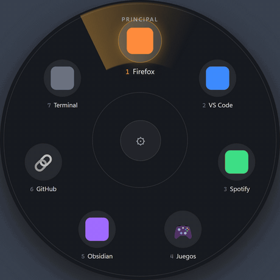

<p align="center">
  
</p>

<h1 align="center">Nimbo</h1>

Un menú radial para Windows: pulsas un atajo de teclado, aparece una rueda con
tus programas alrededor del cursor, eliges uno y desaparece. Sin ventana
principal, sin barra: vive en la bandeja del sistema y sólo se asoma cuando lo
llamas.


<p align="center">
  
</p>

---

## Qué hace

- **Varias ruedas, un atajo cada una.** Una para el trabajo, otra para juegos,
  otra para lo que quieras. Cada una con su propia combinación de teclas.
- **Tres tipos de elemento:** programas instalados, enlaces web y carpetas
  (que se pueden anidar, para agrupar sin llenar la rueda).
- **Se maneja con teclado.** Flechas para moverte por el anillo, `1`-`9` para
  ir directo a un elemento, `Enter` para abrir, `Esc` para salir o retroceder.
- **Toggle:** si el programa ya está abierto, volver a pulsarlo lo cierra.
  Configurable por elemento.
- **Cuatro formas de añadir un programa:** arrastrarlo a la ventana, elegirlo
  con el explorador, pegar su ruta, o buscar entre los instalados.
- **Temas:** Grafito, Papel, Malva, o el que use Windows en cada momento.
- **Cuatro tamaños de rueda**, de S a XL, para que no se quede pequeña en 4K.
- **Reordenar y renombrar** cualquier elemento: la posición en el círculo es
  también la tecla 1-9 que lo abre, así que el orden importa.
- **Respeta los argumentos** del acceso directo (un navegador con un perfil
  concreto, un juego con su launcher).
- **Iconos personalizables** en carpetas y enlaces: emoji o imagen propia.
- **Arranque con Windows** opcional, desde el menú de la bandeja.

## Instalación

Requiere [Node.js](https://nodejs.org/) 18 o superior.

```bash
git clone <este-repo>
cd nimbo
npm install
npm start
```

Al arrancar no verás ninguna ventana: busca el icono en la bandeja del sistema
(junto al reloj). Ahí tienes **Configurar...**, **Iniciar con Windows** y
**Salir**.

## Compilar

```bash
npm run pack     # aplicacion suelta en dist/win-unpacked/ (recomendado)
npm run dist     # ademas, instalador NSIS en dist/
```

`npm run pack` deja **`dist/win-unpacked/Nimbo.exe`**, que ya es una
aplicación completa y portable: se puede ejecutar o anclar tal cual, sin
instalar nada.

> **Cierra la aplicación antes de compilar.** `electron-builder` reescribe
> `dist/win-unpacked/` entero, y si el `.exe` está en uso Windows le impide
> sustituir los ficheros: la build muere a medias y deja el paquete
> inservible — le faltan los `.pak` de Chromium, que es donde vive hasta la
> hoja de estilos por defecto, así que la aplicación arranca mostrando HTML
> crudo. Los dos scripts lo comprueban antes de empezar
> (`check-not-running.js`) y se niegan a arrancar si te lo dejas abierto. Si
> ya te ha pasado: borra `dist/win-unpacked/` y vuelve a compilar.

### El fallo de los symlinks de `winCodeSign`

`electron-builder` baja sus herramientas para Windows (entre ellas `rcedit`,
que es quien incrusta el icono y la version en el `.exe`) dentro de un `.7z`
que **tambien** trae enlaces simbolicos de macOS. Windows no deja crearlos sin
privilegios, `7za` devuelve error y electron-builder aborta:

```
ERROR: Cannot create symbolic link ... winCodeSign\...\libcrypto.dylib
```

Afecta a `pack` igual que a `dist`, y lo peligroso es que **no siempre se nota**:
`dist/win-unpacked/` puede quedar completo y arrancar, pero con el icono y los
metadatos de Electron en vez de los de Nimbo. Compruebalo asi:

```powershell
(Get-Item dist\win-unpacked\Nimbo.exe).VersionInfo.ProductName   # Nimbo, no Electron
```

Los dos enlaces que fallan son de macOS y aqui no sirven para nada, asi que
basta con extraer el paquete a mano ignorandolos, con el nombre exacto que
electron-builder busca en su cache:

```bash
CACHE="$LOCALAPPDATA/electron-builder/Cache/winCodeSign"
./node_modules/7zip-bin/win/x64/7za.exe x -y "$CACHE"/*.7z -o"$CACHE/winCodeSign-2.6.0"
```

Con esa carpeta ya en su sitio no vuelve a descargar, y las builds salen
limpias. Las alternativas, si prefieres conceder el privilegio: activar el
**Modo de desarrollador** (Configuracion -> Sistema -> Para desarrolladores) o
lanzar la build desde una terminal **como administrador**.

Ojo con la cache si has sufrido esto: cada intento fallido deja una carpeta
huerfana y su `.7z` de 5,6 MB en `winCodeSign/`. Se acumulan rapido (llegaron a
225 MB aqui); se pueden borrar todas menos `winCodeSign-2.6.0`.

## Uso

### La rueda

El atajo por defecto de la rueda "Principal" es <kbd>Ctrl</kbd> +
<kbd>Shift</kbd> + <kbd>Space</kbd>. Vuelve a pulsarlo para cerrarla, o haz
click fuera.

| Tecla | Qué hace |
|---|---|
| <kbd>←</kbd> <kbd>→</kbd> <kbd>↑</kbd> <kbd>↓</kbd> | Mover la selección por el anillo (da la vuelta) |
| <kbd>Tab</kbd> / <kbd>Shift</kbd>+<kbd>Tab</kbd> | Igual, hacia delante y hacia atrás |
| <kbd>1</kbd> … <kbd>9</kbd> | Abrir directamente ese elemento (el número va en la etiqueta) |
| <kbd>Enter</kbd> / <kbd>Espacio</kbd> | Abrir el seleccionado |
| <kbd>Esc</kbd> / <kbd>Retroceso</kbd> | Salir de una carpeta, o cerrar la rueda |

El botón del centro es <kbd>⚙</kbd> en el nivel raíz (abre la configuración) y
<kbd>⬅</kbd> dentro de una carpeta.

### La configuración

Desde la bandeja → **Configurar...**, o pulsando el centro de la rueda.

- **Ruedas** (columna izquierda): crear, seleccionar y ver el atajo de cada una.
- **Atajo:** click en el botón y pulsa la combinación. Necesita al menos un
  modificador (Ctrl, Alt, Shift o Win). Si la combinación ya la usa otra rueda
  o cualquier otra aplicación del sistema, te lo dice y no la asigna.
- **Añadir programa / enlace / carpeta.** Máximo **8 elementos por nivel** — la
  rueda tiene un tamaño fijo y a partir de ahí las etiquetas se solapan. Si
  necesitas más, agrupa en carpetas.

### Añadir un programa

Pulsando **+ Añadir programa** se abre un panel con cuatro caminos. Ninguno
escanea nada salvo el último:

| Cómo | Cuándo conviene |
|---|---|
| **Arrastrar y soltar** sobre la ventana | Lo más rápido: arrastra el `.exe` o su acceso directo desde el escritorio, el menú Inicio o el explorador. Admite varios a la vez. |
| **🗂 Examinar...** | Cuando sabes dónde está pero no lo tienes a mano para arrastrar. |
| **📋 Pegar ruta...** | Cuando ya tienes la ruta copiada. Acepta comillas alrededor, que es como la copia el explorador. |
| **🔍 Buscar instalados** | El escaneo completo del menú Inicio. Tarda unos segundos, así que ya no se lanza solo: sólo si lo pides. |

Se aceptan `.exe` y `.lnk`. De un acceso directo se resuelve el programa al que
apunta, pero se conserva **el nombre del acceso directo** (arrastras "Google
Chrome", no quieres que acabe llamándose "chrome").

Lo que sueltes cae en el nivel que estés editando si el panel está abierto, o
en la raíz de la rueda seleccionada si no.
- **"Cerrar si abierto":** por elemento, decide si volver a lanzarlo cierra el
  programa en vez de abrir otra instancia.
- **Tema** y **tamaño de la rueda** (abajo a la izquierda): se aplican y se
  guardan al instante, no esperan al botón de Guardar. El tamaño se ve la
  próxima vez que abras la rueda.
- **▲▼ para reordenar** y **✏️ para renombrar**, en cada fila. El número de la
  izquierda es la tecla que abre ese elemento en la rueda.
- El resto de cambios **no se guardan solos**: pulsa **Guardar todo**.

La configuración vive en:

```
%APPDATA%\Nimbo\config.json
```

## Temas

Cuatro opciones: **Grafito** (pizarra fría con acento latón), **Papel** (blanco
frío con tinta teal), **Malva** (berenjena con coral) y **Automático**, que
sigue el modo claro/oscuro de Windows sin necesidad de reiniciar.

Todos los colores viven en `renderer/theme.css` como variables CSS, y las
comparten la rueda y la ventana de ajustes. Añadir un tema es añadir un bloque
`[data-theme='...']` ahí y una entrada en la lista `THEMES` de `settings.js`;
no hay ningún color escrito a mano fuera de ese fichero.

Para verlos los tres a la vez sin abrir la aplicación, abre
`preview/themes.html` en el navegador (doble clic, no hace falta servidor). Es
la rueda real con datos de mentira: sirve para juzgar paletas y para probar el
sector de luz con las flechas.

## Estructura

```
main.js            Proceso principal: ventanas, atajos globales, bandeja, IPC
preload.js         Puente aislado renderer ↔ main (window.nimbo)
appScanner.js      Escaneo del menú Inicio y alta de programas sueltos
processUtils.js    Detectar y cerrar procesos ya en marcha
assets/
  logo.svg              La marca sobre transparente (bandeja)
  icon.svg / icon.png   Icono de aplicacion, con fondo (ventanas e instalador)
  tray.png              El de la bandeja, transparente
  wordmark.svg          NIMBO monolineal; la O es el propio simbolo
renderer/
  theme.css             Paletas: todas las variables de color, para las dos ventanas
  radial.html/css/js    La rueda
  settings.html/js      La ventana de configuración
preview/themes.html   Las tres paletas lado a lado, sin arrancar la app
preview/logo.html     La marca a sus tamanos reales, incluido el de 16 px
test_radial.js        Check de la navegación del anillo
test_appscanner.js    Check del alta de programas
```

## Notas de implementación

Cosas que parecen raras y no lo son. Están comentadas en el código, pero
conviene saberlas antes de "simplificarlas":

- **`disable-features=CalculateNativeWinOcclusion`.** La detección nativa de
  ventanas ocultas de Chromium choca con ventanas transparentes y
  always-on-top en Windows 10/11 y provoca un crash nativo.
- **Los `.lnk` se resuelven con PowerShell, no con `shell.readShortcutLink()`.**
  Esa API de Electron tumba el proceso entero (fallo `NOTREACHED` de Chromium,
  no capturable con `try/catch`) ante accesos directos mal formados. En un
  proceso aparte, un shortcut roto como mucho se falla a sí mismo.
- **Cierre forzado sólo para procesos sin ventana.** Un programa con ventana
  puede tener cambios sin guardar, así que se le pide un cierre normal. Los de
  bandeja (sin `MainWindowHandle`) no tienen ese riesgo.
- **El autoarranque en desarrollo se escribe a mano en el registro.**
  `app.setLoginItemSettings()` no entrecomilla las rutas, y eso rompe el
  arranque en cualquier cuenta de Windows cuyo nombre de usuario tenga un
  espacio.
- **`window.prompt()` no existe en Electron** (`confirm()` sí), de ahí el
  diálogo propio.
- **`electronDist` apunta al Electron de `node_modules`.** Por defecto
  `electron-builder` se descarga su propia copia del mismo binario que `npm
  install` ya bajo; apuntarlo al local ahorra la descarga y evita que la build
  dependa de que las releases de GitHub respondan.
- **No hay forma de listar los atajos globales ocupados en Windows.** Lo único
  posible es intentar registrar uno y ver si entra; eso hace `check-shortcut`.
- **El config se escribe a un temporal y se renombra encima.** `rename` es
  atómico en el mismo volumen: un corte a media escritura deja el config
  anterior intacto en vez de un JSON truncado. Y si el fichero existe pero no
  se puede leer, se aparta a `config.corrupto-<marca>.json` en vez de
  machacarse — un error transitorio (un antivirus mirándolo) no debe costarte
  todas tus ruedas.
- **La rueda se agranda escalando el diseño de 480 px entero**, no recalculando
  radios y tamaños de fuente. Una sola fuente de verdad: nada puede quedar a
  una escala distinta del resto.

## Limitaciones conocidas

- La rueda sale centrada en el monitor, no bajo el cursor. Es deliberado: evita
  los casos raros al invocarla cerca de un borde.
- **`Get-Process` no ve la ruta de los procesos elevados**, así que "cerrar si
  abierto" no funciona con programas que corren como administrador. Está
  comprobado que `Get-CimInstance Win32_Process` tampoco los ve desde una
  sesión sin elevar (mismos procesos ilegibles por ambas vías), así que no hay
  arreglo sin elevar Nimbo entero. Al menos ya no falla en silencio: avisa por
  consola con los PID afectados.
- Sólo Windows. El escaneo de programas, el autoarranque y el cierre de
  procesos dependen del registro, `taskkill` y el menú Inicio.

## Licencia

[MIT](LICENSE). Haz lo que quieras con esto: usarlo, modificarlo, distribuirlo
o venderlo, siempre que mantengas el aviso de copyright. Sin garantia de
ningun tipo.
